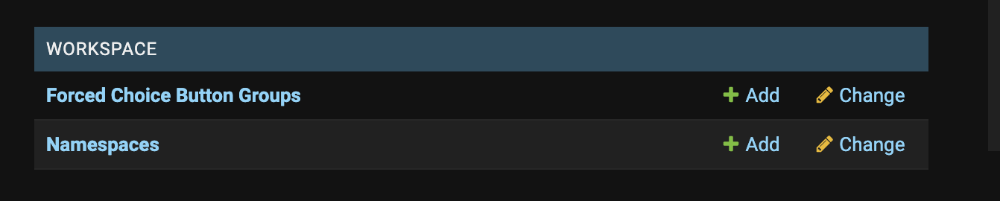
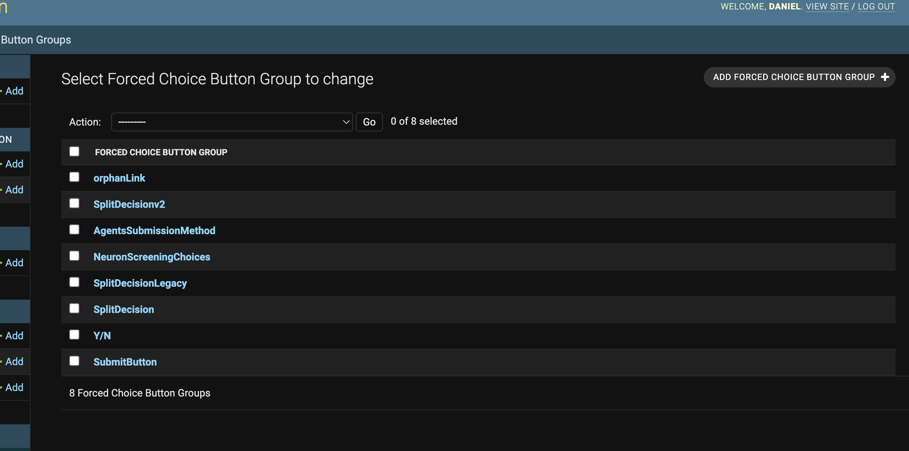
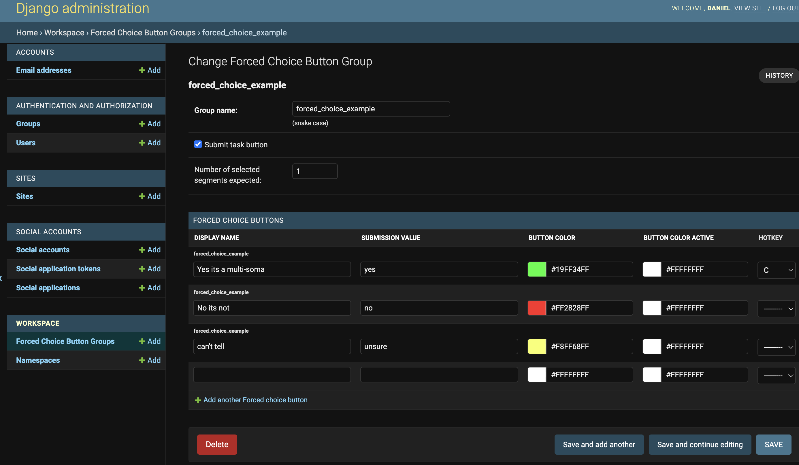
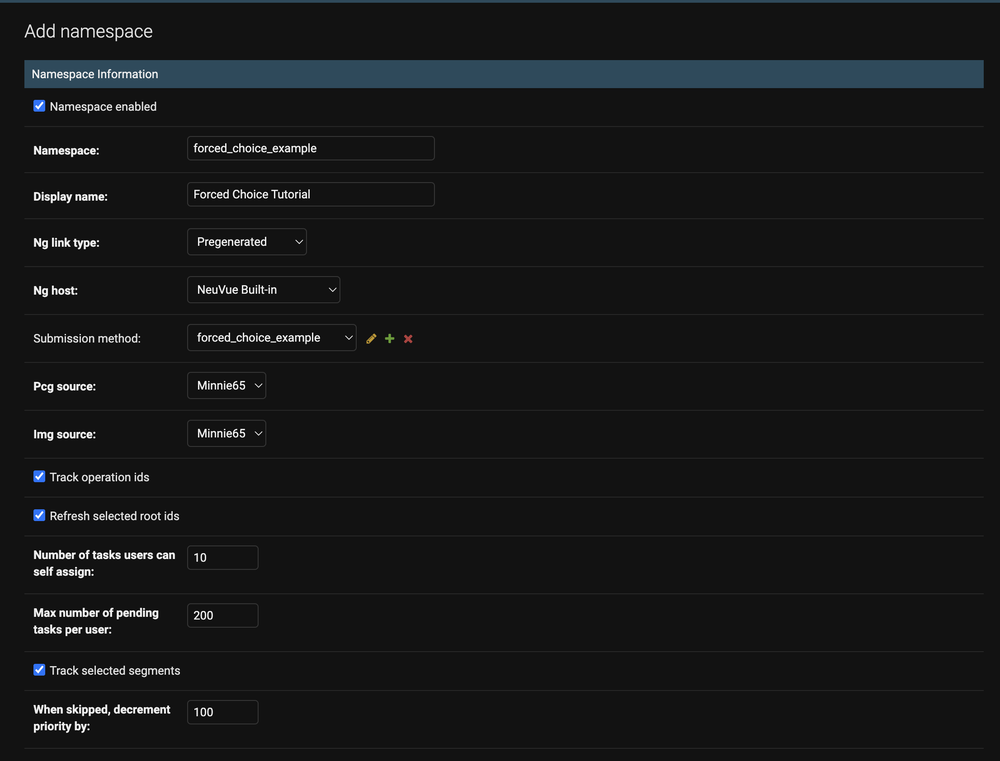

# Generic Forced Choice Task

An example forced choice tasks that asks the proofreader to determine if a multi-soma present in the latest nucleus detection table (nucleus_neuron_svm) is an actual multi-soma or a misclassified cell. The purpose of this task is to illustrate how forced choice tasks are created and how to parse the decisions.

| Task Namespace          | `forcedChoiceExample` |
|-------------------------|---------------|
| Submission Method       | forcedChoiceExampleButtons |
| CAVE Required?          | Yes            |
| External Data Required? | No            |

## Creating Tasks

Run the `minnie_multisoma_forced_choice` notebook from start to finish to create the tasks in the queue. Make sure to edit the notebook variables, such as namespace and assignee, to the specific task type and people you want to add the task for.

## Creating the Forced Choice Button Group

In the production stack, the `forcedChoiceExample` namespace has already been created. For posterity, here is the steps to create a forced choice button group and attach it to new namespace.

1. Navigate to the admin console and click "Forced Choice Button Groups"

2. Click "Add Forced Choice Button Group" button on the top right.

3. Fill out the form with the desired buttons and colors. A couple notes:

- The "Submit task button" checkmark lets you add a classic "submit" button to the button row for users to make a decision, perform an action like an edit, and then submit the task. If unselected, there will be no "submit" button and the task is automatically submitted when a decision is made.

- "number of selected segmented expected" is a feature we added for tasks that involve leaving certain seg IDs selected for task submission, usually to merge them later. This is useful for tasks where the proofreader is expected to select `n` segments and then submit the task. This option helps prevent user error by creating an additional modal before the proofreader submits the task if the number of selected segments in their neuroglancer state is less or greater than `n`. 

- Display name is what is seen on the proofreader workspace. Submission value is the string stored in the database under the 'decision' attribute when the proofreader clicks that button. 

- You can attach hotkeys to buttons to make your task easier to submit.

4. Once you have created the forced choice button group, navigate to `Namespaces` on the left-hand column on the admin console to create a new namespace that uses this button group. Below is the configuration we chose for the namespace used in this tutorial. 

